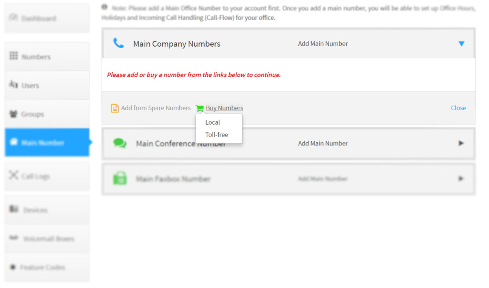
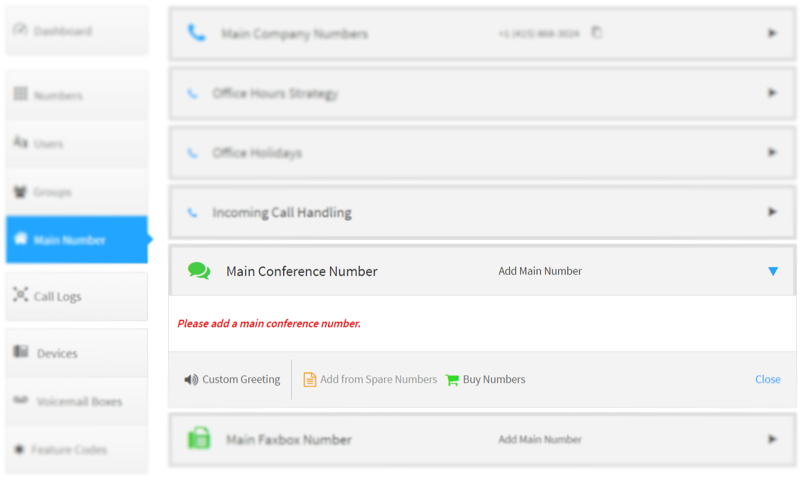
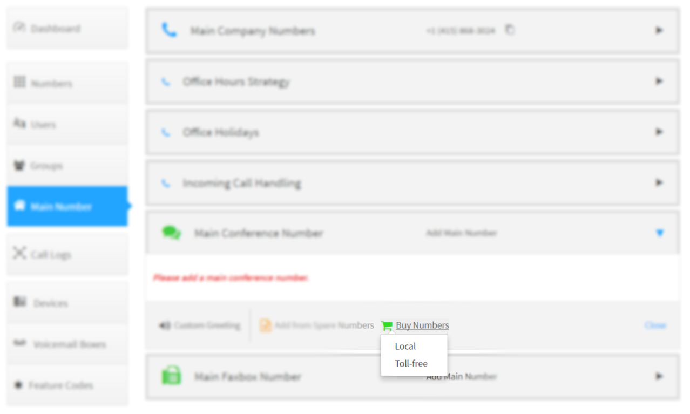
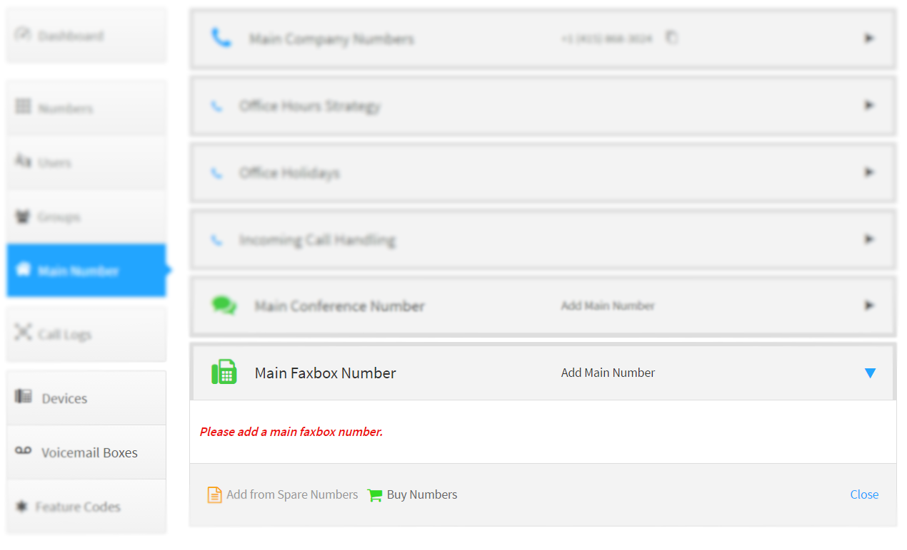
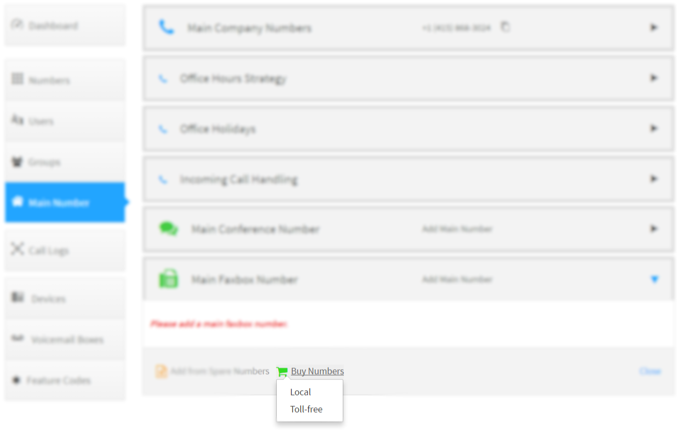
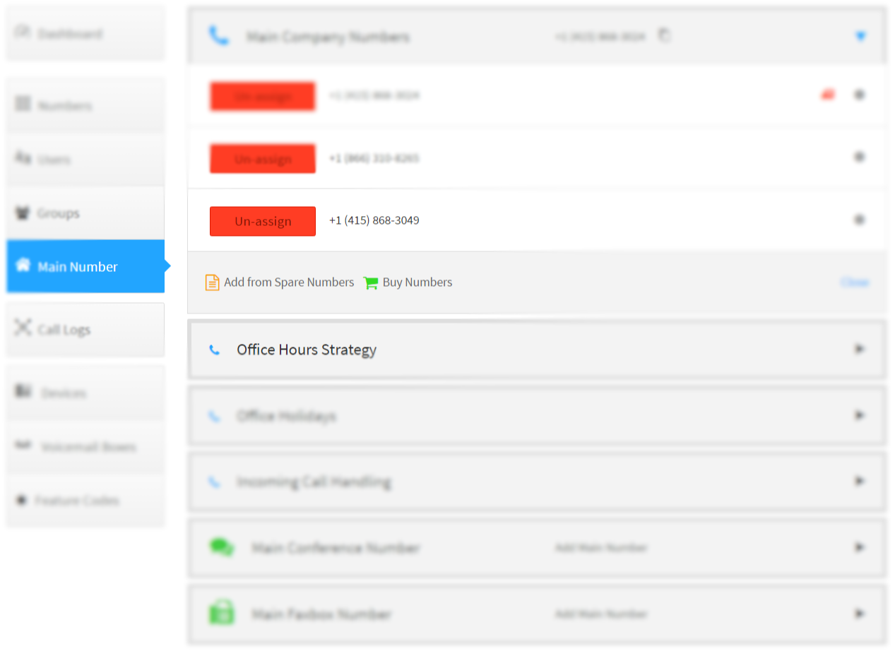

# Number Management

Acquiring and managing the phone numbers on an account is simple in Kazoo.  Using the available applications adminstrators can purchase new numbers with instant activation, manage features such the emergency address, assign to users or devices and move them between accounts.

> Who can use this feature?
> All adminstrators have access to these features.

## What You Should Know

Stuff goes here:

| Service Name | Description |
| --- | --- |
| DID |  |
| Item2 | Item2 Description |

>> Keep in Mind: After clicking `Buy Numbers` you may be presented with the changes to the monthly billing amount.  Clicking `Accept` will allow the numbers to be purchased or `Cancel` will make no change.

## Purchasing the Company Main Numbers

1. Switch to the SmartPBX application and select the `Main Number` tab.

2. Expand the `Main Company Numbers`, then click the `Buy Numbers` and select `Local`

3. Enter the area code for the desired location then click `Search`

4. Select one or more numbers and click `Buy Numbers`

5. The numbers selected will now be listed and will be active within 5 minutes

## Purchasing Company Toll-Free Numbers

1. Switch to the SmartPBX application and select the `Main Number` tab.

2. Expand the `Main Company Numbers`, then click the `Buy Numbers` and select `Toll-free`

3. Select a toll-free prefix then click `Search`

4. Select one or more numbers and click `Buy Numbers`

5. The numbers selected will now be listed and will be active within 5 minutes

## Purchasing Numbers for Users

1. Switch to the SmartPBX application and select the `Users` tab.

2. In the column under `Phone Numbers` click on the row with the User to add a phone number to.

3. In the column under `Phone Numbers` click on the row with the User to add a phone number to.

4. Select `Local` or `Toll-free` and follow the same steps as indicated above to complete the purchase.

## Purchasing Company Conference Numbers

1. Switch to the SmartPBX application and select the `Main Number` tab.

2. Expand the `Main Conference Number`, then click the `Buy Numbers`

3. Select `Local` or `Toll-free` and follow the same steps as indicated above to complete the purchase.

## Purchasing Company Fax Number

1. Switch to the SmartPBX application and select the `Main Number` tab.

2. Expand the `Main Faxbox Number`, then click the `Buy Numbers`

3. Select `Local` or `Toll-free` and follow the same steps as indicated above to complete the purchase.

## Setting the Company Emergency Address

1. Switch to the SmartPBX application and select the `Main Number` tab.

2. Expand the `Main Comany Numbers`, then click the gear icon next to the number and select `e911`

3. Enter the emergency address and click add

4. Ensure the emergency enabled icon appears

## Using Spare Numbers

>> A spare number is one that has been purchased for the account then `unassigned` but not deleted.

1. Switch to the SmartPBX application and proceed as you would for number purchasing

2. Click on `Add from Spare Numbers`

3. Select the spare numbers and click on `Add selected numbers`

