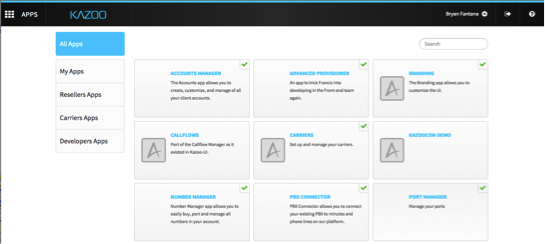

# Adding Apps to Your Dashboard
After logging in, your Monster dashboard will be displayed along with the available Apps.

Click on the App you are interested in using and turn it on.

All of the Apps that have been turned on can be accessed when you click on the “Apps” icon on the top right corner of the UI.

Here you can specify user access as well.

