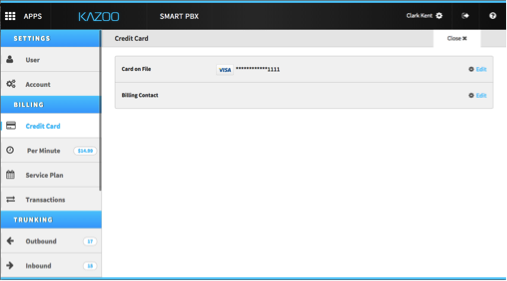

# Adding a Credit Card on File

To put your credit card on file, click on Settings Icon at the top left of the UI.

This is combined with your name.

Once in Settings, click on Credit Card.

Enter pertinent information for both Card on File and Billing Contact.

