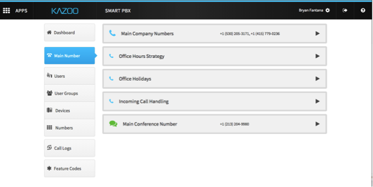

# Add Main Number

In the Main Number tab, add your Main Number and set up your Main Conference Number.

You can add a number that is in the Spare Numbers, Purchase a Number or Port a Number.

A more detailed description on how to port, purchase and assign spare numbers can be found in [../first_office/README.md][Setting up Your First Office].

