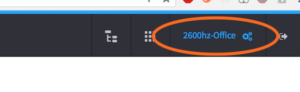
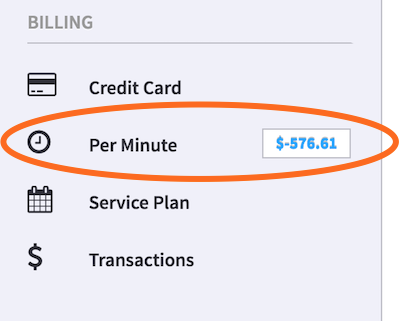
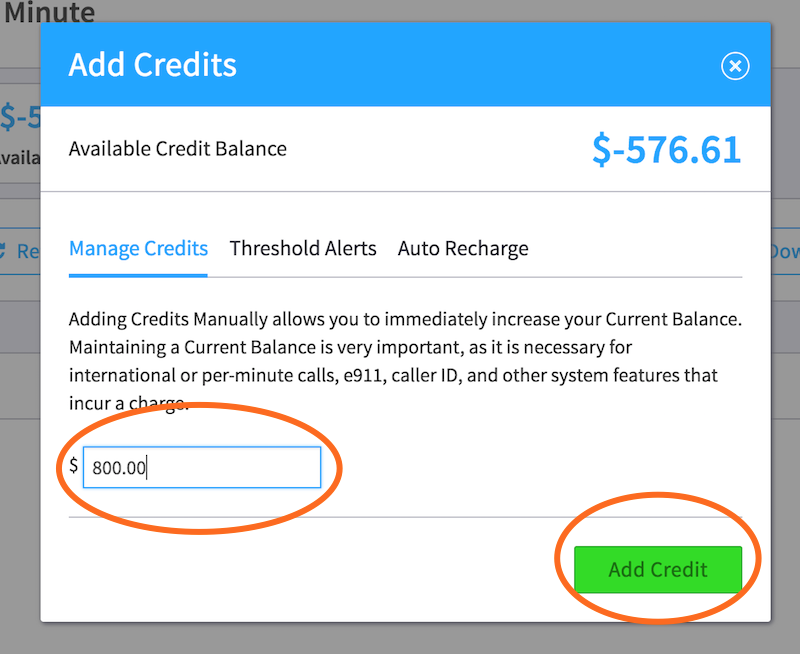

## Usage Based Services

Usage based services are pre-pay services charged against your account each time you use them. You deposit money into your account, then as you use certain per-use features (such as international calls) the cost is deducted from your balance.

> Who can use this feature?
> This feature is available to Hosted Platform users.

### What You Should Know

The following items are all considered pay-per-use services:

| Service Name | Description |
| --- | --- |
| International Calls | Billing occurs for each minute that elapses for answered calls |
| Number Ports | A one-time fee is charged for each number you port into the system |

>> Keep in Mind: Depending on your business needs, some services may be included in your service plan at no charge. Typical examples are US long distance calling. You should check your service agreement for details.

### Adding Credit to Your Account

In order to utilize pay-per-use services you must first deposit money into your account. These funds represent your available balance (or "credit") and remain in the account until depleted. These amounts also roll over monthly.

To add credit:
1. Click your Control Center

2. Select Per Minute on the left hand side

3. At the top of the screen, select Add Credit

4. Enter an amount to add and click Add Credit

### Per-Minute Services

Per-minute services require you to deposit money into the account before you start making calls.

To add credit to your account, click "Per Minute" just left of the main dashboard.

Then Add Credit (must be a minimum of $5).

### SIP Trunks

SIP Trunks are flat-rate channels that allow for inbound and outbound calling.

When you are within Settings, you can locate Trunking just left of the dashboard.

You have three trunking options:
    * __Outbound__: the number of concurrent outbound calls you can make at once.
    * __Inbound__ – the number of concurrent inbound calls that can be made at once.
    * __Two-Way__ - the number of concurrent inbound and outbound calls that can be made at once.

### Billing

Once SIP trunks are set up, users will be billed on a recurring monthly basis and can be seen in the Service Plan within Settings.

Per-Minute Billing will be ongoing until it runs out, then it will need to be recharged.

Auto-recharge is available.

[!embed](https://www.youtube.com/watch?v=O4uVS6KGlho)
