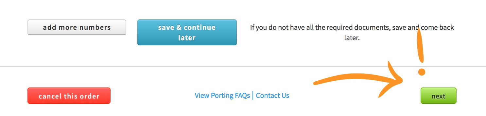

# Getting Started With Port Manager

So lets get this ball rolling and go over how to submit a Port Request through the Port Manager application

> Who can use this feature?

> This feature is open to all users across all platforms

## What You Should Know

Here's some terminology you may encounter while submitting a port request:

| Service Name | Description |
| --- | --- |
| Item1 | Item1 Description |
| Item2 | Item2 Description |

>> Keep in Mind: look! a tip goes here!

## Your Step-by-Step Guide to Glory

>> Tip! 

>> Don't fret, you can add additional numbers at your hearts desire during this process, even though we use an example of one number for this guide!

1. Let's get this kicked off. First, hop into the Port Manager application. It looks like this:

2. Once we're inside the app, click "New Port Request".

3. Type out the number you're requesting to port.

4. Don't ignore the important parts here. Read each of these dandy check boxes and confirm you understand.

5. Lets go ahead and name this request so you can easily find it in the future.

6. Time to upload a current phone bill that has the number(s) you're porting, and fill out the fields so they match what is on your bill.

7. This step is important--Make sure the number(s) you've requested are on the bill you just attached in step 6!

8. If you are porting regular numbers, upload a signed LOA here. 

9. If you are porting toll-free numbers, upload a signed RespOrg here.

10. Here's a bit of choose-your-own-adventure! Either add some more numbers, save and come back later, cancel, or keep chugging along!

11. Back to some basics, who should we keep in the loop on this request?

12. Lets choose a date we prefer, then review our settings and SUBMIT! Woohoo! (or save and come back later, I suppose.)

