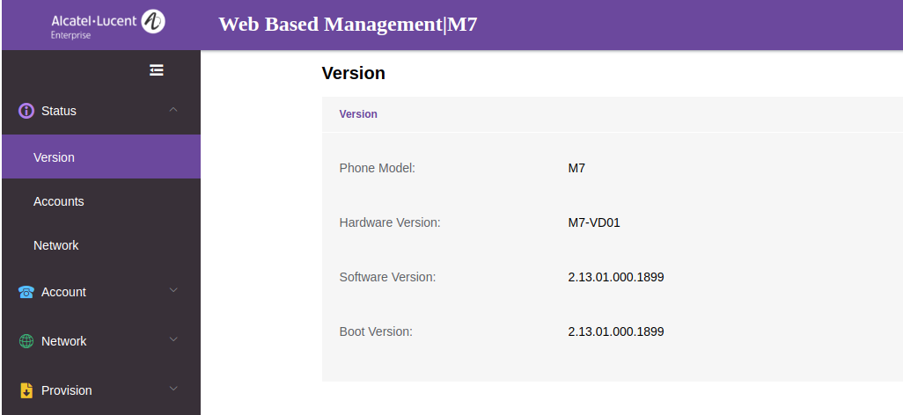
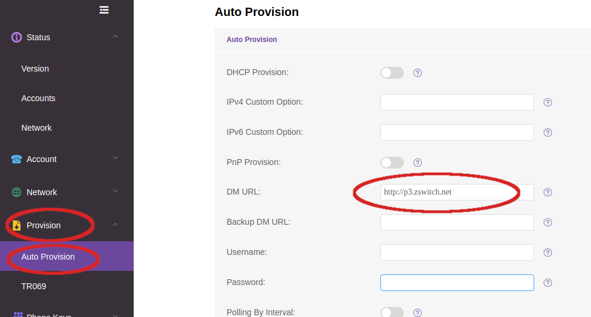
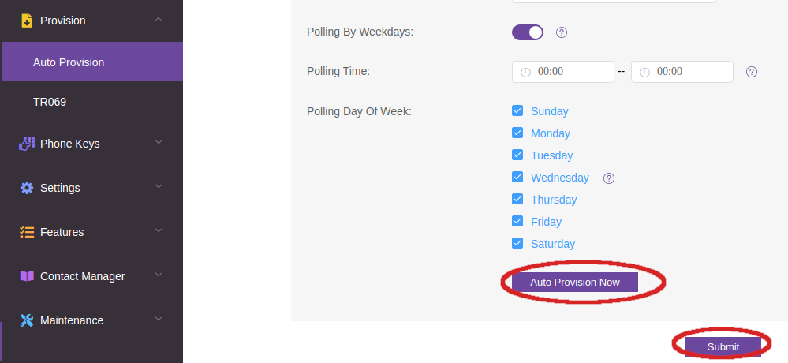
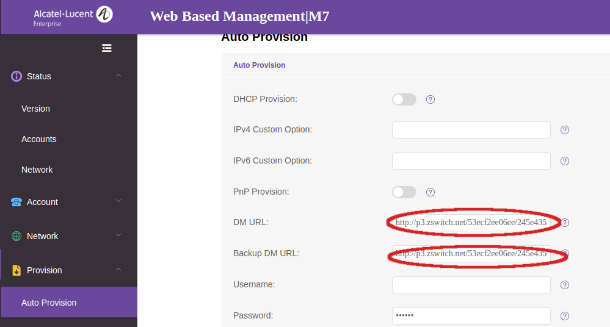

# Provisioning Alcatel-Lucent

This is a guide to auto-provision a [Alcatel-Lucent](https://www.aledevice.com/site/desktop_phone).

> Who can use this feature?
> Administrators who are deploying phones hooked up to our provisioning service.

## Steps to Auto Provision device

1. Add Device
    - First add the device to Provisioner by following the instructions here: [Adding Devices Guide](../prov_start_guide.md)
2. Reset to Factory Settings
    - Please also make sure that you have reset your device to factory settings. To do so, press the “Conference” hard key and hold it for ten seconds. The device will ask if you want to reset to factory settings, select ”OK.”
3. Obtain Phone’s IP Address
    - Once the device is restore to its defaults, search for the device's IP address. The IP address is needed in order to provision a Alcatel-Lucent phone, you will first need to get its IP address to access the phone's web interface.
    - The IP address on Alcatel-Lucent devices can easily be found by pressing the OK button on the phone. You should see a Status screen with a line containing the IP address, for example: `IPv4: 10.10.9.88`. Please make sure that your device jack is plugged in. If it is not plugged in, the IP address will not be displayed as expected.
4. Enter the IP Address and Login
    - In your browser, enter this IP address. When logging in for the first time, the default username is `admin` and password is `123456`.
    - The page should look something like this:
    
5. Autoprovision Device
    - From there, click the "Provision" option in the side menu and then select "Auto Provision". Uncheck `DHCP Provision` and `PnP Provision` if available and input `http://p3.zswitch.net` in the `DM URL` field.
    
    - `Submit` the changes and then press `Auto Provision Now`. The phone should reboot, if not then try manually rebooting the phone.
    
    - The `DM URL` and `Backup DM URL` should be updated with the new paths. Keep in mind that the page might ask you to login again and if the web UI password was changed in the Auto Provision then the new password must be used.
    