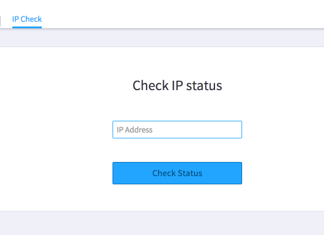
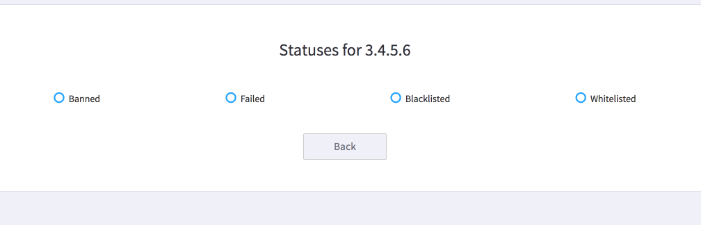

# IP Status Check Tool

This is a guide to check if a given IP is blocked by Provisioner security or triggered any security checks.

> Who can use this feature?
> Administrators who are managing phones hooked up to our provisioning service.

## Checking IP Status

This tool checks to see if an IP address is blocked from provisioning due to abuse or other issues.

Enter the public IP address that the phone sits on in the IP Address textbox and then click the "Check Status" button.

Note: 192.168.X.X or 10.X.X.X IPs are NOT public IPs, please enter only public IP addresses. Ask your IT administrator for help if you need it.

## Understanding IP Status results

The results of a status check should look something like this:

There are 4 different statuses for a given IP: Banned, Failed, Blacklisted, Whitelisted.

Banned – If this status is checked, then this IP is temporarily banned because someone tried to load a config file manually, repeatedly tried to provision phones that weren’t yet in our system, or a few other reasons. This ban will automatically be removed at the start of the next hour, at which point you can try again.

Failed – If this status is checked, then there were failed attempts to request config files from this IP. Please check your device logs to see if any of your devices are failing to pick up their config files.

Blacklisted – If this status is checked, then this IP is permanently blacklisted. To be removed from the blacklist, please contact support. If you do not have a support contract, please use the forums to list your complaint.

Whitelisted – IPs are added to the whitelist on the first successful provisioning attempt from an IP. If it's not on the whitelist, then phones on the IP either hasn't reached Provisioner, or is blacklisted.