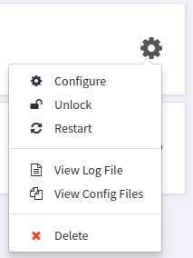

# Logs and Config Files

This is a guide to understanding viewing Logs and Config Files.

> Who can use this feature?
> Administrators who are managing phones hooked up to our provisioning service.

## Accessing Device Logs and Config Files

To access the Device Logs or Device Config Files, just click on the settings icon for a device and the dropdown will show options to view Log File or Config Files.

## Config Files

Selecting "View Config Files" opens up a screen with a list of config files for a given device and an option to download files. Most brands only have a single config files, but some brands, like Polycom and Yealink, have multiple config files.

## Log File

Selecting "View Config Files" opens up a screen showing activity Provisioner has logged for the device. It'll show entries for when the device is create, updated or deleted through Smart PBX or Advanced Provisioner. It also shows when a phone is locked or unlocked for initial provisioning and device requests for config files.