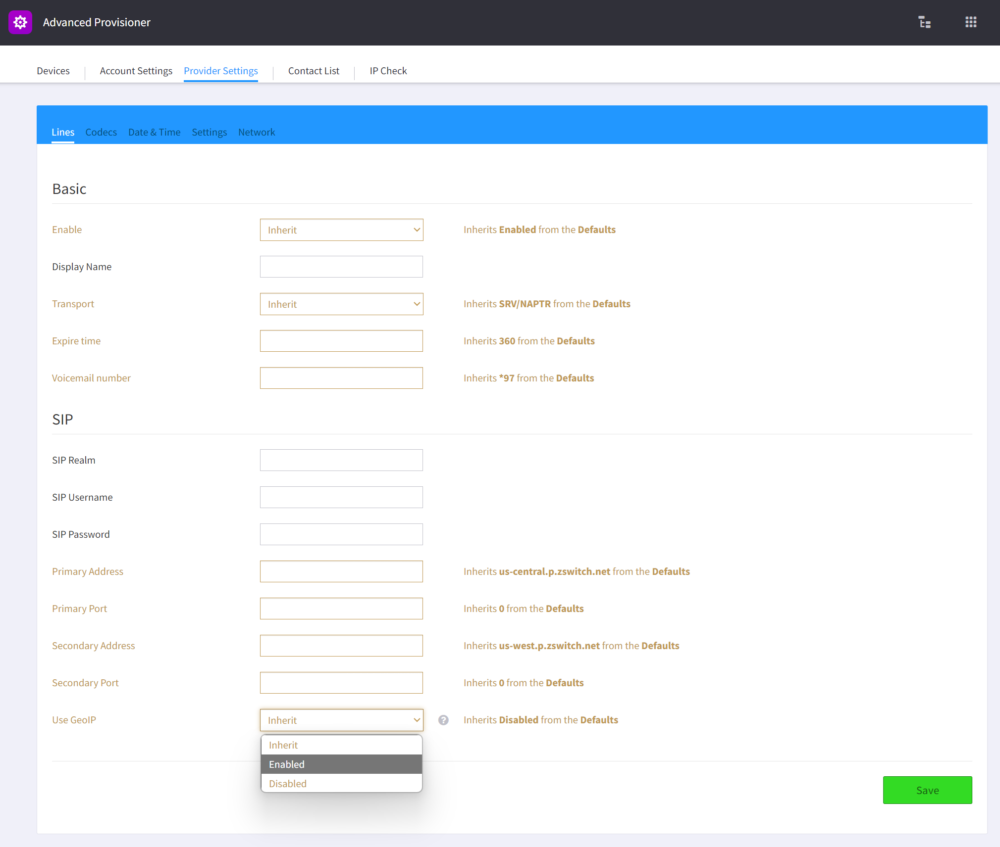

# GeoIP
This is a guide on Provisioner's GeoIP feature. Here we explain what it does and how to set it up.

> Who can use this feature?
> Anyone using our hosted provisioning service to provision phones.

## What you should know
The following are descriptions of terms used in this guide:

| Term | Descriptions |
| --- | --- |
| Initial Provisioning Phase | This is the first phase of auto-provisioning that happens with a brand new device or factory reset device. This was introduced with the [Security Update](../security/security.md). |

## What does it do?
The GeoIP feature of Provisioner was built to select the closest outbound proxy to the phone when it is initially provisioned and using the global default proxy settings. This way system administrators do not need to manually change the outbound proxy settings for each phone. This feature is opt-in, so by default it is disabled.

## Opting in at the Reseller or Account Level
To opt in, you simply need to go into Advanced Provisioner for the account and open up either Provider Settings or Account Settings (the former sets up for a Reseller account propogating to all child accounts while the latter only sets for one end user account). At the bottom of the `Lines` settings page in the `SIP` section, there is a dropdown titled `Use Geoip`. Set it to `Enabled` and save.

A window will pop up to ask if you would like to regenerate all the configuration files.

Selecting the green Yes button will regenerate all the configuration files so if there are a lot of devices it would take a while to finish. After saving, `Use GeoIP` will now show up in the device settings as `Inherits Enabled from the Provider` or `Inherits Enabled from the Account` depending on which level you setup GeoIP on.

## How does it work?
During the initial provisioning phase, if the provisioning script detects that the proxy settings are inheriting only from Global Defaults, it will do a geolocation lookup using the public IP of the phone at that moment. Then, based on the geolocation, calculates the closest outbound proxy of the cluster. For our Hosted Platform, it would use our cluster settings.

## Private Cloud and Global Infrastructure setup
When first installing Provisioner, we will create a cluster document in our database to store your cluster level settings. To setup GeoIP, we need a list of proxy addresses with the following information:
	- IP: IP address of the primary media server. This is used to determine the geolocation to use this proxy setting
	- Primary Address: Hostname or IP of the primary outbound proxy
	- Primary Port: Port for the primary outbound proxy
	- Secondary Address: Hostname or IP of the secondary outbound proxy for failover
	- Secondary Port: Port for the secondary outbound proxy
	- Longitude and Latitude (optional): Longitude and Latitude coordinates for calculating closest proxy
If you are using SRV records for [failover](../failover/failover.md), then we need a list of proxy addresses with the following information:
	- IP: IP address of the primary media server. This is used to determine the geolocation to use this proxy setting
	- Primary Address: Hostname of the primary outbound proxy.
	- Longitude and Latitude (optional): Longitude and Latitude coordinates for calculating closest proxy
