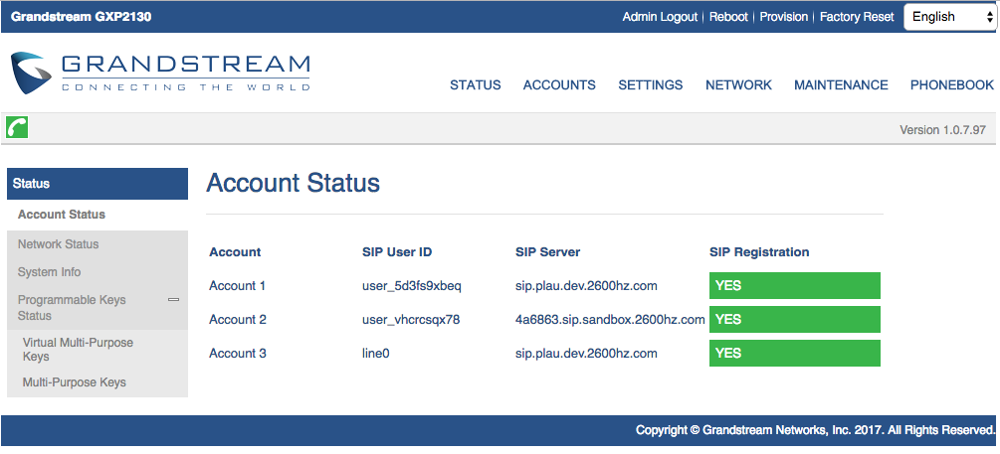

# Provisioning Grandstream GXP21xx Series

Provisioning a Grandstream [GXP21xx](http://www.grandstream.com/sites/default/files/Resources/gxp21xx_administration_guide.pdf) device can be accomplished in five easy steps:

## Steps to Auto Provision device

- Step 1: Add Device
    - First add the device to Provisioner by following the instructions here: [Adding Devices Guide](./prov_start_guide.org)
- Step 2: Reset to Factory Settings
    - Please also make sure that you have reset your device to factory settings. To do so, hit the center button on the directional pad, navigate to "System" and then "Factory Reset".
- Step 3: Obtain Phone’s IP Address
    - The IP address for a Grandstream GXP21xx device can be found on the device itself. In order to provision a Grandstream GXP21xx phone, you will first need to get its IP address in order to access the phone's web interface. The IP address on Grandstream GXP21xx devices can easily be found by pressing the center button on the directional pad, navigate to "Status" and then "Network Status". You should see a line with, for example: "IPv4: 10.10.9.88". Please make sure that your device jack is plugged in. If it is not plugged in, it will read IP: 0.0.0.0.
- Step 4: Enter the IP Address and Login
    - In your browser, enter this IP address. When logging in for the first time, the default username is admin and password is admin. The page should look something like this:

- Step 5: Auto-provision Device
    - Most of the information as you will see has already been pre-populated. You’ll need go to "Maintenance", then click on "Upgrade and Provisioning" on the drop-down menu. In the "Config Server Path", input the provisioning URL p3.zswitch.net and select "HTTP" for the "Upgrade via" setting. Also remove the URL from "Firmware Server Path". Provisioner will provide one during the Initial Provisioning phase. Please ensure there are no extra spaces or characters in this field. Your screen should look like this:

    - Click “Save and Apply” on the bottom of the page, then “Provision” at the top of the page.  This may take up to a few minutes, but if done correctly, you’ll notice your device reboot as it going through the Initial Provisioning phase. The Initial Provisioning phase is part of the security measure to verify the device before providing the full provisioning URL path to the configuration file. After Initial Provisioning, the "Firmware Server Path" is populated and the "Config Server Path" is updated with two folders appended to the end (e.g. p3.zswitch.net/05ba94c0fe6f/ac438d0d3c39). It should look like this:

    - Since Grandstreams do not provide a setting to automate reboot, just click "Provision" at the top of the page again to finish provisioning the phone.
