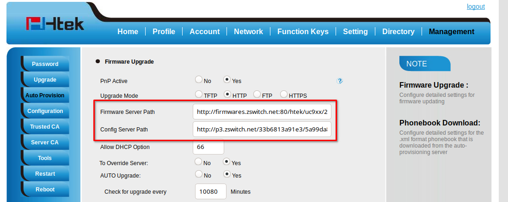

# Provisioning Htek

This is a guide to auto-provision a Htek [UC9xx](http://www.htek.com/products/UC900_Series/index.**html**).

> Who can use this feature?
> Administrators who are deploying phones hooked up to our provisioning service.

## Steps to Auto Provision device

1. Add Device
    - First add the device to Provisioner by following the instructions here: [Adding Devices Guide](../prov_start_guide.md)
2. Reset to Factory Settings
    - Please also make sure that you have reset your device to factory settings. To do so, To do so dial `*`, `*`, `*`, and then hold the `x` button for 10 seconds.
3. Obtain Phone’s IP Address
    - The IP address for a Htek UC9xx device can be found on the device itself. In order to provision a Htek UC9xx phone, you will first need to get its IP address in order to access the phone's web interface. The IP address on Htek UC9xx devices can easily be found by pressing the center button on the directional pad, select "Information". You should see a line with, for example: "IPV4: 10.10.9.88". Please make sure that your device jack is plugged in. If it is not plugged in, it will read IP: 0.0.0.0.
4. Enter the IP Address and Login
    - In your browser, enter this IP address. When logging in for the first time, the default username is `admin` and password is `admin`. The page should look something like this:
    
5. Auto-provision Device
    - Most of the information as you will see has already been pre-populated.
    - Step 1: You’ll need go to "Management"
    - Step 2: Click on "Auto Provisioning" on the left side menu.
    - Step 3: In the "Config Server Path", input the provisioning URL p3.zswitch.net
    - Step 4: Remove the URL from "Firmware Server Path". Provisioner will provide one during the Initial Provisioning phase. Please ensure there are no extra spaces or characters in this field.
    - Step 5: Select "HTTP" for the "Upgrade Mode" setting.
    - Your screen should look like this:
    
    - Click "SaveSet" on the bottom of the page:
    
    - Then click “Provision” at the middle of the page:
    
    - This may take up to a few minutes, but if done correctly, you’ll notice your device reboot as it going through the Initial Provisioning phase. The Initial Provisioning phase is part of the security measure to verify the device before providing the full provisioning URL path to the configuration file. After Initial Provisioning, the "Firmware Server Path" is populated and the "Config Server Path" is updated with two folders appended to the end (e.g. p3.zswitch.net/05ba94c0fe6f/ac438d0d3c39). It should look like this:
    
    - Click again the "Autoprovision Now" button at the middle of the page to finish provisioning the phone.
