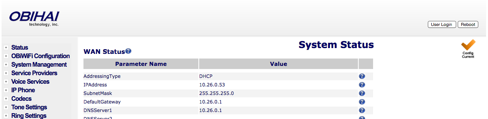
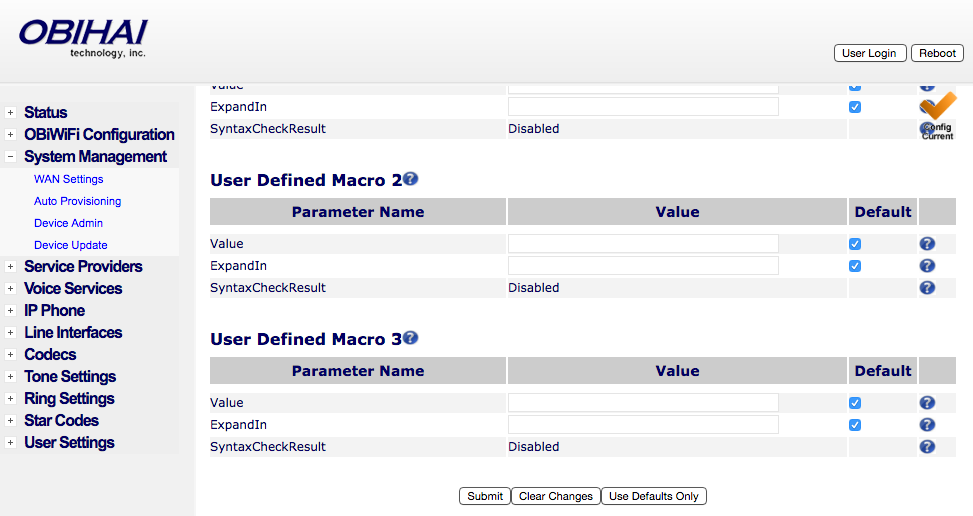
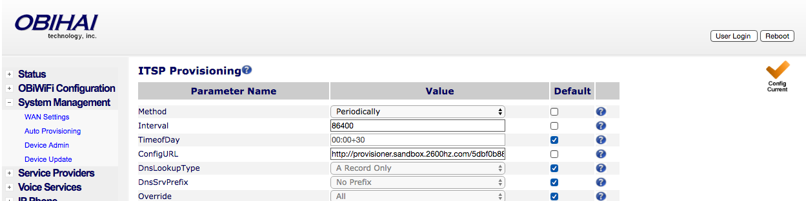

# Provisioning Obihai

This is a guide to auto-provision an [Obihai](http://www.obihai.com/product-primer) excluding the 100 series.

> Who can use this feature?
> Administrators who are deploying phones hooked up to our provisioning service.

## Steps to Auto Provision device

1. Add Device
    - First add the device to Provisioner by following the instructions here:
    [Adding Devices Guide](../prov_start_guide.md)
2. Reset to Factory Settings
    - Please also make sure that you have reset your device to factory settings. To do so, navigate to the "Settings" menu and "Factory Reset" would appear as a soft key. Push it and it’ll ask for the admin password ("admin" is the default password).
3. Obtain the IP Address
    - The IP address for a Obihai device can be found on the device itself. In order to provision a Obihai phone, you will first need to get its IP address in order to access the phone's web interface.
    - The IP address on OBi10xx devices can easily be found by navigating to the "Settings" menu on the phone. You should see a line with the word "Network" and below an IP address. Please make sure that your device jack is plugged in. If it is not plugged in, it will read IP: `0.0.0.0`.
    - On OBi20x, OBi30x and OBi50x, pick up the handset to the ATA and dial "* * *", dial 1 at the promt and you will hear the IP address spoken out. If you need to repeat the IP address, just press 0.
4. Enter the IP Address and Login
    - In your browser, enter this IP address. When logging in for the first time, the default username is admin and password is admin.
    - The page should look something like this:
    
4. Autoprovision Device
    - Most of the information as you will see has already been pre-populated. You’ll need to click on System Management on the side, then click on Auto Provisioning. Uncheck the "Default" checkbox for the "ConfigURL" field under ITSP Provisioning and input the provisioning URL `http://p3.zswitch.net/$DM.xml`.
    
    - Please ensure there are no extra spaces or characters in this field. Click "Submit" on the bottom of the page, then the Reboot button on the top right.
    
    - This may take up to a few minutes, but if done correctly, you’ll notice your device reboot as it is provisioning. You are now all set up.  In the end, your page should look like this:
    
