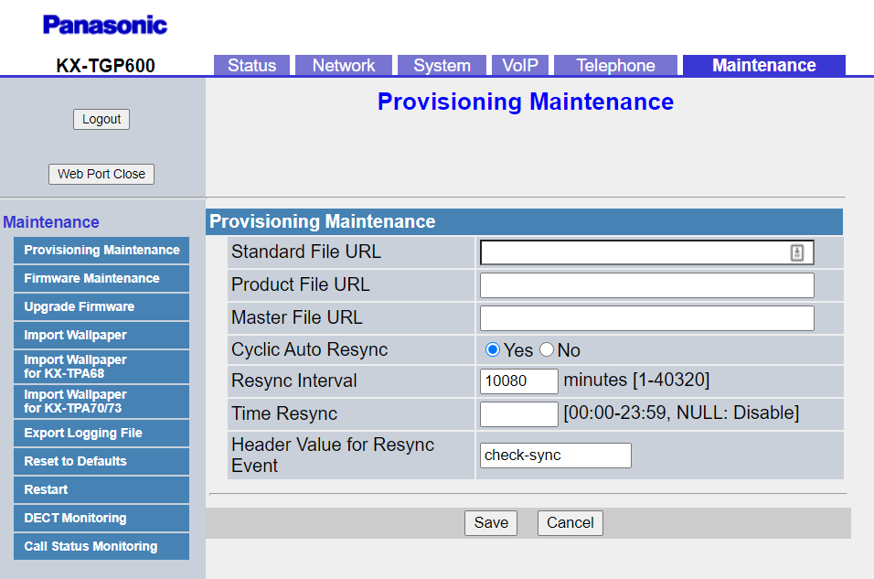
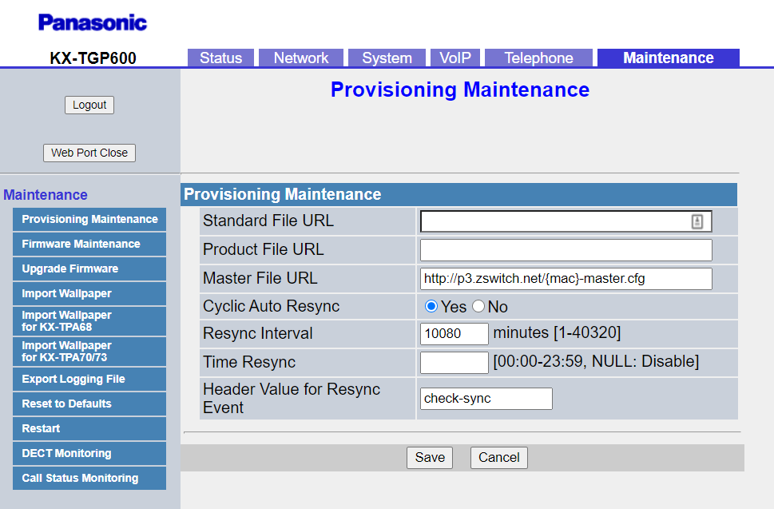

# Provisioning Panasonic

This is a guide to auto-provision a [Panasonic TGP600](https://na.panasonic.com/us/office-products-unified-communications/unified-communications/sip-phones/kx-tgp600-sip-cordless).

> Who can use this feature?
> Administrators who are deploying phones hooked up to our provisioning service.

## Steps to Auto Provision device

1. Add Device
    - First add the device to Provisioner by following the instructions here: [Adding Devices Guide](../prov_start_guide.md)
2. Enable Web UI
    - Hit the Menu key to enter the settings menu.
    - Select System Settings -> Network Settings -> Embedded Web -> On.
3. Obtain Phone’s IP Address
    - Hit the Menu key to enter the settings menu.
    - Select System Settings -> Status -> IPv4 Settings -> IP Address. 
4. Enter the IP Address and Login
    - In your browser, enter this IP address. When logging in for the first time, the default username is admin and password is adminpass. Then you'll be promted to change the default password. 
    - If this isn't the first time logging in, then factory reset the device by entering the Maintenence Tab and selecting the Reset to Defaults option in the sidebar.
    
5. Autoprovision Device
    - After logging in for the first time (or after factory reset), navigate back to the Maintenance tab. In the "Master File URL," input the provisioning URL `http://p3.zswitch.net/{mac}-master.cfg`.
    
    - Please ensure there are no extra spaces or characters in this field. Click "Save" on the bottom of the page, then "Restart" in the sidebar.  This may take up to a few minutes, but if done correctly, you’ll notice your device reboot as it is provisioning. You are now all set up.
