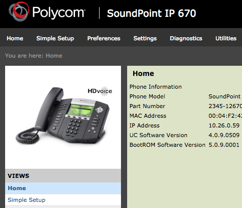
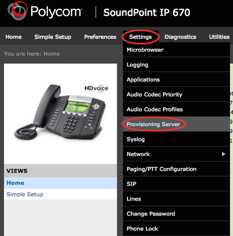
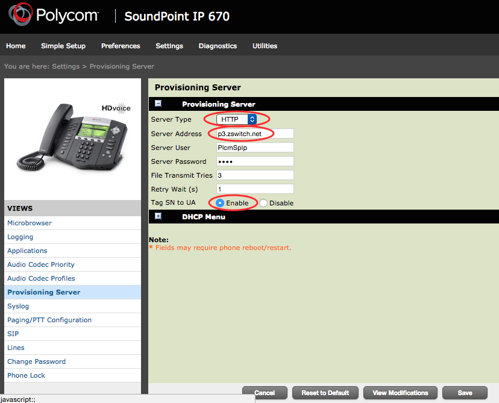
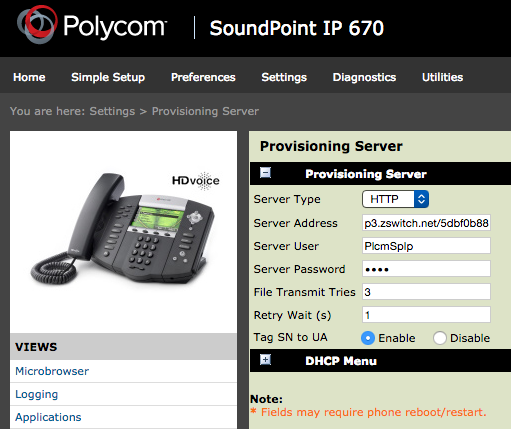

# Provisioning Polycom

This is a guide to auto-provision a [Polycom](http://www.polycom.com/voice-conferencing-solutions/desktop-ip-phones.html).

> Who can use this feature?
> Administrators who are deploying phones hooked up to our provisioning service.

## Steps to Auto Provision device

1. Add Device
    - First add the device to Provisioner by following the instructions here:
    
2. Reset to Factory Settings
    - Please also make sure that you have reset your device to factory settings by following these steps:
    - Click on the Menu
    - Select 3: Settings
    - Select 2: Advanced (Password 456)
    - Select 1: Admin Settings
    - Select 5: Reset to Defaults
    - Select 5: Reset To Factory Settings
3. Obtain Phone’s IP Address
    - In order to provision a Polycom phone, you will first need to get its IP address in order to access the phone's web interface. To do so, find the menu on the phone and then press “Menu > Status > Platform > Phone.”  You should see a line as you scroll down, for example: `IP: 10.10.9.88`. Please make sure that your device jack is plugged in. If it is not plugged in, it will read `IP: 0.0.0.0.`
4. Enter the IP Address in a New Tab in Your Browser
    - In a new browser tab on your computer, enter this IP address that you see on your device (the default password is "456"). You should see something like this:
    
5. Autoprovision Device
    - From there, click on to "Settings" in the top tab and then select "Provisioning Server."
    
    - In "Server Type" dropdown, choose "HTTP".
    - In "Server Address," input the provisioning URL p3.zswitch.net. (Do not put the http:// in front of it). Please do not alter the “Server User,” “Server Password,” “File Transmit Tries,” or “Retry Wait.”
    - "Tag SN to UA" MUST be set to "Enable"
    - Save changes. The phone should reboot, if not then try manually rebooting the phone.
    
    - Your page should look like:
    
