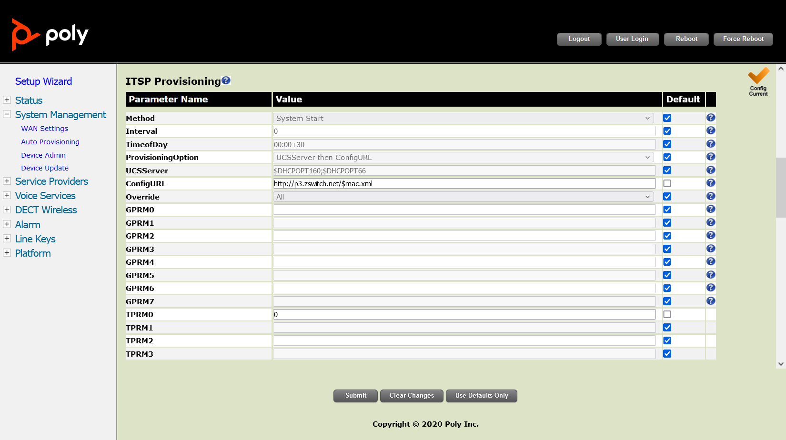

# Provisioning Poly Rove

This is a guide to auto-provision a [Poly Rove](https://www.poly.com/us/en/products/phones/rove).

> Who can use this feature?
> Administrators who are deploying phones hooked up to our provisioning service.

## Steps to Auto Provision device

1. Add Device
    - First add the device to Provisioner by following the instructions here:
    [Adding Devices Guide](../prov_start_guide.md)
2. Obtain the IP Address
    - The IP address for a Poly Rove device can be found on the using the registered handset.
    - Push the Menu button (the button with 3 stacked lines right above the hang up button) and open up Info in the bottom right corner.
    - At the bottom of the screen, the IP Address is listed
3. Enter the IP Address and Login
    - In your browser, enter this IP address. When logging in for the first time, the default username is admin and password is admin.
    - A login popup will show up on the page like this:
    
4. Reset to Factory Settings
    - If the device is already in a factory reset state, it'll ask to change the default password.
    
    - Otherwise, make sure that you have reset your device to factory settings. To do so, navigate to the "System Mangement" menu on the left and click the "Reset" button in the "Reset Configuration" section.
    
5. Autoprovision Device
    - Most of the information as you will see has already been pre-populated. You’ll need to click on "System Management" on the side, then click on "Auto Provisioning". Uncheck the "Default" checkbox for the "ProvisioningOption" field under ITSP Provisioning and input the provisioning URL `http://p3.zswitch.net/$mac.xml`.
    
    - Please ensure there are no extra spaces or characters in this field. Click "Submit" on the bottom of the page, then the Reboot button on the top right leading to a page notifying you the Rove is rebooting.
    
    - This may take up to a few minutes, but if done correctly, you’ll notice your device reboot as it is provisioning. Once the light on the Rove turns green, the device is provisioned and registered.
