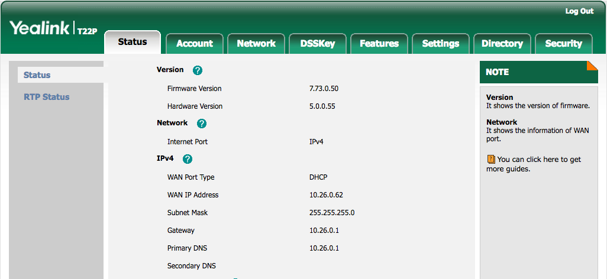
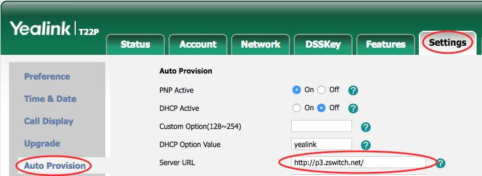

# Provisioning Yealink

This is a guide to auto-provision a [Yealink](http://yealink.com/product_list.aspx?ProductsCateID=1298&BaseInfoCateId=1298&cateid=1298&News_CateId=1298&Cate_Id=1298).

> Who can use this feature?
> Administrators who are deploying phones hooked up to our provisioning service.

## Steps to Auto Provision device

1. Add Device
    - First add the device to Provisioner by following the instructions here: [Adding Devices Guide](../prov_start_guide.md)
2. Reset to Factory Settings
    - Please also make sure that you have reset your device to factory settings. To do so, select “OK” and hold down for six seconds. The device will ask if you want to reset to factory settings, select ”OK.”
3. Obtain Phone’s IP Address
    - The IP address for a Yealink device can be found on the device itself. In order to provision a Yealink phone, you will first need to get its IP address in order to access the phone's web interface.
    - The IP address on Yealink devices can easily be found by pressing the OK button on the phone. You should see a line with, for example: `IP: 10.10.9.88`. Please make sure that your device jack is plugged in. If it is not plugged in, it will read `IP: 0.0.0.0.`
4. Enter the IP Address and Login
    - In your browser, enter this IP address. When logging in for the first time, the default username is admin and password is admin.
    - The page should look something like this:
    
5. Autoprovision Device
    - Most of the information as you will see has already been pre-populated. You’ll need to click on Settings (or Phone on T3x Series) on the top tab, then click on Autoprovision on the left sub-tab. In the "Server URL," input the provisioning URL `http://p3.zswitch.net`.
    
    - Please ensure there are no extra spaces or characters in this field. Click “Confirm” on the bottom of the page, then “Autoprovision Now”.  This may take up to a few minutes, but if done correctly, you’ll notice your device reboot as it is provisioning. You are now all set up.  In the end, your page should look like this:
